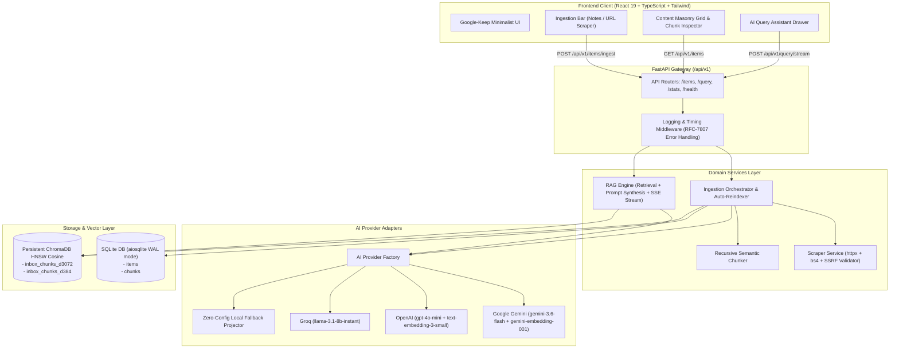
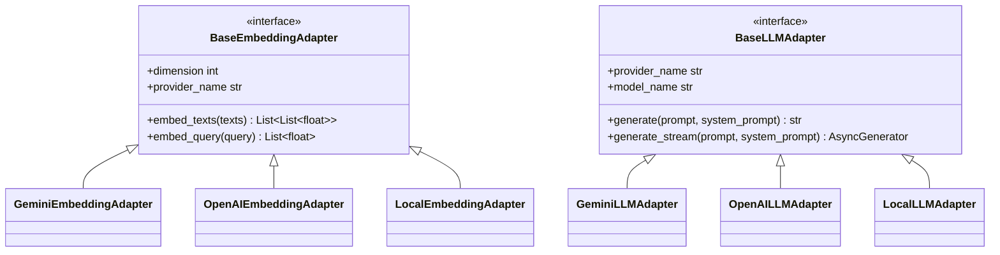

# 📚 AI Knowledge Inbox: Comprehensive Architectural Deep Dive & Engineering Guide

> A complete, step-by-step educational breakdown of the full-stack **AI Knowledge Inbox** architecture — covering layered software design, async ingestion, semantic chunking, multi-provider AI adapters, vector databases, real-time SSE streaming RAG, and React frontend state management.

---

## 📑 Table of Contents
1. [End-to-End System Architecture](#1-end-to-end-system-architecture)
2. [Layer-by-Layer Detailed Breakdown](#2-layer-by-layer-detailed-breakdown)
   - [2.1 API & Gateway Layer](#21-api--gateway-layer)
   - [2.2 Ingestion & Web Scraping Layer (with SSRF Guard)](#22-ingestion--web-scraping-layer-with-ssrf-guard)
   - [2.3 Intentional Semantic Chunking Engine](#23-intentional-semantic-chunking-engine)
   - [2.4 Relational Database Layer (SQLite + Pydantic Serialization)](#24-relational-database-layer-sqlite--pydantic-serialization)
   - [2.5 Vector Database Layer (ChromaDB + Multi-Dimension Partitioning)](#25-vector-database-layer-chromadb--multi-dimension-partitioning)
   - [2.6 Multi-Provider AI Adapter Pattern](#26-multi-provider-ai-adapter-pattern)
   - [2.7 RAG Pipeline & Real-Time SSE Streaming](#27-rag-pipeline--real-time-sse-streaming)
   - [2.8 Frontend React Architecture & UI System](#28-frontend-react-architecture--ui-system)
3. [Step-by-Step Data Flow Traces](#3-step-by-step-data-flow-traces)
   - [Flow A: Note & URL Ingestion Flow](#flow-a-note--url-ingestion-flow)
   - [Flow B: Streaming RAG Query Flow](#flow-b-streaming-rag-query-flow)
4. [Tradeoff Analysis & Scaling Strategies](#4-tradeoff-analysis--scaling-strategies)

---

## 1. End-to-End System Architecture



---

## 2. Layer-by-Layer Detailed Breakdown

### 2.1 API & Gateway Layer

#### 🎯 Responsibilities:
- Receive HTTP requests and enforce strict input validation using **Pydantic v2 schemas**.
- Inject request correlation IDs (`X-Request-ID`) and track millisecond response execution time (`X-Response-Time`).
- Sanitize error outputs into **RFC-7807 compliant JSON error responses** with standardized error codes.

#### 💡 Code Implementation:
```python
# backend/app/api/middleware.py
class RequestLoggingMiddleware(BaseHTTPMiddleware):
    async def dispatch(self, request: Request, call_next) -> Response:
        request_id = request.headers.get("X-Request-ID", str(uuid.uuid4())[:8])
        start_time = time.perf_counter()
        request.state.request_id = request_id

        try:
            response = await call_next(request)
            duration_ms = round((time.perf_counter() - start_time) * 1000, 2)
            response.headers["X-Request-ID"] = request_id
            response.headers["X-Response-Time"] = f"{duration_ms}ms"
            return response
        except Exception as exc:
            duration_ms = round((time.perf_counter() - start_time) * 1000, 2)
            logger.error(f"[{request_id}] {request.method} {request.url.path} FAILED: {exc}")
            raise
```

---

### 2.2 Ingestion & Web Scraping Layer (with SSRF Guard)

#### 🎯 Responsibilities:
- **Server-side URL scraping**: Fetches remote web pages using `httpx.AsyncClient` with user-agent spoofing, redirect follows, and timeout handling.
- **HTML Parsing & Noise Stripping**: Removes `<script>`, `<style>`, `<nav>`, `<footer>`, `<header>`, `<aside>`, forms, and embeds. Converts headings (`#`, `##`), paragraphs, and lists into clean Markdown.
- **Metadata Extraction**: Extracts `<title>`, OpenGraph `og:title`, `og:description`, `author`, domain, and favicon.
- **SSRF (Server-Side Request Forgery) Protection**: Validates that target URLs do not point to localhost, private IP ranges (`127.0.0.0/8`, `10.0.0.0/8`, `192.168.0.0/16`, `172.16.0.0/12`), or cloud metadata services (`169.254.169.254`).

#### 💡 SSRF Validation Guard:
```python
# backend/app/core/security.py
PRIVATE_IP_NETWORKS = [
    ipaddress.ip_network("127.0.0.0/8"),
    ipaddress.ip_network("10.0.0.0/8"),
    ipaddress.ip_network("172.16.0.0/12"),
    ipaddress.ip_network("192.168.0.0/16"),
    ipaddress.ip_network("169.254.0.0/16"),
    ipaddress.ip_network("::1/128"),
]

def validate_url_security(url_str: str) -> str:
    parsed = urlparse(url_str)
    if parsed.scheme not in ("http", "https"):
        raise SSRFSecurityError(url_str, "Only HTTP/HTTPS schemes allowed.")
    
    # Resolve IP address to block DNS rebinding to private intranet
    ip_info = socket.getaddrinfo(parsed.hostname, None)
    for entry in ip_info:
        ip_obj = ipaddress.ip_address(entry[4][0])
        for net in PRIVATE_IP_NETWORKS:
            if ip_obj in net or ip_obj.is_private or ip_obj.is_loopback:
                raise SSRFSecurityError(url_str, f"Target resolves to restricted IP ({ip_obj}).")
    return url_str
```

---

### 2.3 Intentional Semantic Chunking Engine

#### 🎯 Why Chunking Strategy Matters:
- **Naive fixed-character chunking** (e.g. cutting every 500 characters) cuts words and sentences in half, ruining vector embeddings.
- **Recursive boundary chunking** hierarchically splits text:
  1. Double newlines (`\n\n`) -> preserves paragraphs.
  2. Single newlines (`\n`) -> preserves lists / lines.
  3. Sentence punctuation (`. `, `? `, `! `) -> preserves complete thoughts.
  4. Spaces (` `) -> preserves full words.
- **Sliding Window Overlap (~100 chars)**: Retains trailing context from chunk $N$ at the start of chunk $N+1$ so concepts straddling chunk boundaries are not lost during similarity search.

```
Original Document:
[ Paragraph 1 (300 chars) ] \n\n [ Paragraph 2 (350 chars) ]

Chunk 1: [ Paragraph 1 ] (300 chars)
Overlap window: ~100 chars from end of Chunk 1
Chunk 2: [ Overlap from Paragraph 1 ... + Paragraph 2 ]
```

#### 💡 Recursive Chunker Implementation:
```python
# backend/app/services/chunker_service.py
class ChunkerService:
    def _split_text_recursively(self, text: str, max_size: int) -> List[str]:
        if len(text) <= max_size:
            return [text]
        for sep in ["\n\n", "\n", ". ", "? ", "! ", " "]:
            if sep in text:
                parts = text.split(sep)
                merged = []
                current = ""
                for p in parts:
                    candidate = f"{current}{sep}{p}" if current else p
                    if len(candidate) <= max_size:
                        current = candidate
                    else:
                        if current: merged.append(current)
                        current = p
                if current: merged.append(current)
                return merged
        return [text[i:i + max_size] for i in range(0, len(text), max_size)]
```

---

### 2.4 Relational Database Layer (SQLite + Pydantic Serialization)

#### 🎯 Responsibilities:
- Store raw note content, scraped HTML text, metadata (tags, author, domain, favicon, created_at, updated_at).
- Store individual chunk records mapped with foreign key `ON DELETE CASCADE`.
- Enable WAL (Write-Ahead Logging) for concurrent reads without lock contention.
- **Pydantic Model Serialization**: Uses `ItemRecord` and `ChunkRecord` with `from_row(row)` and `to_db_tuple()` methods.

#### 💡 Schema & Repository:
```sql
CREATE TABLE items (
    id TEXT PRIMARY KEY,
    type TEXT NOT NULL,           -- 'note' | 'url'
    title TEXT NOT NULL,
    content TEXT NOT NULL,
    url TEXT,
    source_metadata TEXT NOT NULL DEFAULT '{}',
    tags TEXT NOT NULL DEFAULT '[]',
    chunk_count INTEGER NOT NULL DEFAULT 0,
    created_at TEXT NOT NULL,
    updated_at TEXT NOT NULL
);

CREATE TABLE chunks (
    id TEXT PRIMARY KEY,
    item_id TEXT NOT NULL,
    chunk_index INTEGER NOT NULL,
    text TEXT NOT NULL,
    char_count INTEGER NOT NULL,
    token_estimate INTEGER NOT NULL,
    metadata TEXT NOT NULL DEFAULT '{}',
    FOREIGN KEY(item_id) REFERENCES items(id) ON DELETE CASCADE
);
```

---

### 2.5 Vector Database Layer (ChromaDB + Multi-Dimension Partitioning)

#### 🎯 The Vector Dimension Challenge & Solution:
- Different embedding models produce different vector dimensions:
  - **Local Fallback**: 384 dimensions
  - **OpenAI `text-embedding-3-small`**: 1536 dimensions
  - **Google Gemini `gemini-embedding-001`**: 3072 dimensions
- Standard vector databases throw errors if query vector dimension does not match collection dimension (`Collection expecting embedding with dimension of 384, got 3072`).
- **Our Solution**:
  1. **Dimension-Partitioned Collections**: Namespaces collections dynamically by dimension (`inbox_chunks_d3072`, `inbox_chunks_d384`, `inbox_chunks_d1536`).
  2. **Automatic Startup Sync (`sync_all_chunks_to_vector_store`)**: When you add an API key (e.g. Gemini), on startup the system re-embeds all existing SQLite chunks into the active dimension's collection with zero data loss.

#### 💡 Chroma Partitioning Implementation:
```python
# backend/app/vector_store/chroma_store.py
class ChromaVectorStore(BaseVectorStore):
    def _get_or_create_collection_for_dim(self, dim: int):
        coll_name = f"inbox_chunks_d{dim}"
        return self.client.get_or_create_collection(
            name=coll_name,
            metadata={"hnsw:space": "cosine"}
        )

    async def similarity_search(self, query_embedding: List[float], top_k: int = 5):
        dim = len(query_embedding)
        collection = self._get_or_create_collection_for_dim(dim)
        results = collection.query(query_embeddings=[query_embedding], n_results=top_k)
        ...
```

---

### 2.6 Multi-Provider AI Adapter Pattern

#### 🎯 Design Pattern: Strategy / Factory Pattern
We define two abstract interfaces:
1. `BaseEmbeddingAdapter`: Generates dense numerical vectors for document chunks and user queries.
2. `BaseLLMAdapter`: Generates grounded answers and streams response tokens.



#### 💡 Dynamic Factory Resolution:
```python
# backend/app/llm/factory.py
class AIProviderFactory:
    @staticmethod
    def get_llm_adapter() -> BaseLLMAdapter:
        if settings.OPENAI_API_KEY:
            return OpenAILLMAdapter()
        if settings.GROQ_API_KEY:
            return OpenAILLMAdapter(api_key=settings.GROQ_API_KEY, base_url="https://api.groq.com/openai/v1")
        if settings.GEMINI_API_KEY:
            return GeminiLLMAdapter(model="models/gemini-3.6-flash")
        return LocalLLMAdapter() # Built-in offline fallback
```

---

### 2.7 RAG Pipeline & Real-Time SSE Streaming

#### 🎯 Step-by-Step RAG Execution:
1. **Query Embedding**: The user's question $Q$ is converted into an embedding vector $\vec{v}_q$.
2. **Top-$K$ Vector Retrieval**: Query ChromaDB collection with cosine similarity metric to find top-$k$ nearest chunk vectors.
3. **Citation Formatting**: Each retrieved chunk is assigned an index `[Source 1]`, title, similarity score (e.g. `92% match`), and URL.
4. **Context Prompt Augmentation**: The context chunks are wrapped inside the system prompt:
   ```
   Context from Saved Knowledge Items:
   --- Source [1] (Document Title | Relevance: 88%) ---
   <Chunk text snippet>

   User Question: <User Question>
   Please synthesize an accurate response based ONLY on the context above:
   ```
5. **Server-Sent Events (SSE) Protocol**:
   - `event: sources` -> Emits citation metadata payload first so the UI can render citation cards immediately.
   - `event: token` -> Streams generated answer tokens one by one as they arrive from the LLM.
   - `event: done` -> Emits execution latency in milliseconds and provider metadata.

#### 💡 SSE Streaming Implementation:
```python
# backend/app/services/rag_service.py
async def stream_query(self, request: QueryRequest) -> AsyncGenerator[str, None]:
    start_time = time.perf_counter()
    # 1. Retrieve top-k vector chunks
    citations = await self.retrieve_context(request.question, top_k=request.top_k)

    # 2. Emit sources event first
    sources_payload = [{"item_title": c.item_title, "snippet": c.snippet, "similarity_score": c.similarity_score} for c in citations]
    yield f"event: sources\ndata: {json.dumps(sources_payload)}\n\n"

    # 3. Stream tokens
    prompt = self._build_prompt(request.question, citations)
    async for token in self.llm_adapter.generate_stream(prompt=prompt, system_prompt=SYSTEM_RAG_PROMPT):
        yield f"event: token\ndata: {json.dumps(token)}\n\n"

    # 4. Emit done event with performance latency
    elapsed_ms = round((time.perf_counter() - start_time) * 1000, 2)
    yield f"event: done\ndata: {json.dumps({'latency_ms': elapsed_ms})}\n\n"
```

---

### 2.8 Frontend React Architecture & UI System

#### 🎯 UI Components & Architecture:
- **`IngestBar.tsx`**: Google Keep-style collapsible card with tab switching between "Text Note" and "Save URL", keyboard shortcut `Ctrl+Enter` to submit.
- **`ItemsGrid.tsx` & `ItemCard.tsx`**: Responsive grid displaying notes/URLs with domain link chips, chunk badges, and hover actions.
- **`ItemDetailModal.tsx`**: Dual-tab modal allowing users to inspect the full raw document or drill down into the **Vector Chunks Inspector** (showing character lengths, token estimates, and exact chunk splits).
- **`AIChatDrawer.tsx`**: Floating sidebar powered by `ReadableStream` SSE parser, rendering live tokens with `react-markdown` and interactive `CitationCard` components with match % indicators.

#### 💡 Frontend SSE Stream Reader:
```typescript
// frontend/src/services/api.ts
export async function streamQueryRAG(question: string, top_k: number, callbacks: {
  onSources?: (citations: SourceCitation[]) => void;
  onToken?: (token: string) => void;
  onDone?: (meta: any) => void;
}) {
  const response = await fetch('/api/v1/query/stream', {
    method: 'POST',
    headers: { 'Content-Type': 'application/json' },
    body: JSON.stringify({ question, top_k }),
  });

  const reader = response.body!.getReader();
  const decoder = new TextDecoder('utf-8');
  let buffer = '';

  while (true) {
    const { value, done } = await reader.read();
    if (done) break;
    buffer += decoder.decode(value, { stream: true });
    const lines = buffer.split('\n');
    buffer = lines.pop() || '';

    let currentEvent = '';
    for (const line of lines) {
      if (line.startsWith('event:')) currentEvent = line.substring(6).trim();
      if (line.startsWith('data:')) {
        const data = JSON.parse(line.substring(5).trim());
        if (currentEvent === 'sources') callbacks.onSources?.(data);
        if (currentEvent === 'token') callbacks.onToken?.(data);
        if (currentEvent === 'done') callbacks.onDone?.(data);
      }
    }
  }
}
```

---

## 3. Step-by-Step Data Flow Traces

### Flow A: Note & URL Ingestion Flow

```
[User Action: Ingest URL "https://example.com/article"]
   │
   ▼
[API Endpoint: POST /api/v1/items/ingest]
   │
   ▼
[Scraper Service]: 
   ├── 1. validate_url_security(url) -> ensures not private IP / localhost
   ├── 2. httpx.get(url) -> fetches HTML
   └── 3. BeautifulSoup -> strips scripts/nav/footer, extracts title & markdown text
   │
   ▼
[Chunker Service]:
   ├── Splits text hierarchically on paragraphs / sentences (chunk size: 500 chars)
   └── Adds sliding window overlap (~100 chars)
   │
   ▼
[AI Embedding Adapter]:
   └── Batches chunk texts -> calls Google Gemini gemini-embedding-001 (dim: 3072)
   │
   ▼
[Database & Vector Store]:
   ├── SQLite ItemRepository.create_item_with_chunks() -> stores raw item & chunks
   └── ChromaVectorStore.add_chunks() -> upserts 3072-dim vectors into inbox_chunks_d3072
   │
   ▼
[Response 201 Created]: Returns Item JSON to Frontend -> Instantly rendered in Grid
```

---

### Flow B: Streaming RAG Query Flow

```
[User Action: Ask "How does cosine similarity work?" in AI Assistant]
   │
   ▼
[API Endpoint: POST /api/v1/query/stream]
   │
   ▼
[RAG Service]:
   ├── 1. GeminiEmbeddingAdapter.embed_query(question) -> produces 3072-dim query vector
   ├── 2. ChromaVectorStore.similarity_search() -> retrieves top-k matching chunks
   ├── 3. Emits event: sources -> Frontend immediately displays Citation Cards with % scores
   ├── 4. Builds Augmented Prompt: Context chunks + System prompt + User question
   └── 5. GeminiLLMAdapter.generate_stream() -> calls Gemini 3.6 Flash streaming endpoint
   │
   ▼
[SSE Response Stream]:
   ├── Emits event: token -> Frontend appends tokens to Markdown viewer in real-time
   └── Emits event: done -> Frontend displays latency badge (e.g. 340ms) and model info
```

---

## 4. Tradeoff Analysis & Scaling Strategies

### 1. Chunking Size & Overlap Tradeoffs
| Parameter | Small Chunks (100–300 chars) | Medium Chunks (500–800 chars) *(Our Choice)* | Large Chunks (1500+ chars) |
| :--- | :--- | :--- | :--- |
| **Retrieval Precision** | High (exact sentence match) | Balanced (context + precision) | Low (diluted vector semantic signal) |
| **Context Completeness** | Low (fragmented concepts) | High (complete paragraph context) | High (entire section) |
| **Vector DB Storage** | Higher vector count | Optimal vector density | Lower vector count |

### 2. Vector Store Scaling & Bottlenecks
- **Current Choice**: Persistent local ChromaDB with SQLite.
  - *Pros*: Zero infrastructure overhead, zero network latency, persistent on disk, ideal for single-user and edge deployments.
  - *When it breaks*: When vector count exceeds 500,000 vectors, HNSW index in-memory construction consumes several gigabytes of RAM.
  - *Production Path*: Migrate to distributed vector databases such as **Qdrant**, **Milvus**, or **PgVector (PostgreSQL)** with IVFFlat / HNSW disk partitioning.

### 3. Scraping & Ingestion Bottlenecks
- *Bottleneck*: Ingesting complex Single-Page Applications (SPAs) built with React/Vue that require client-side JavaScript rendering.
- *Mitigation*: Integrate headless browser workers (Playwright / Puppeteer) on a background worker queue (Celery / Redis / Temporal).

---

## 🏁 Summary

This application embodies a complete, enterprise-grade RAG architecture in a clean, lightweight footprint:
- **Resilient**: Works 100% offline with local fallback, and auto-upgrades to Google Gemini / OpenAI / Groq when keys are provided.
- **Self-Healing**: Handles vector dimension mismatches dynamically with partition collections and startup auto-sync.
- **Secure**: Built-in SSRF defenses, input validation, and RFC-7807 structured error responses.
- **Interactive**: Real-time SSE token streaming with cited source verification.
