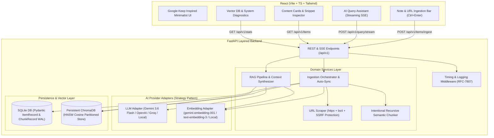

# AI Knowledge Inbox

> A production-grade, minimalist "AI Knowledge Inbox" web application for capturing notes and URLs, performing intelligent semantic chunking and vector storage, and providing high-precision Question-Answering (RAG) with real-time streaming and source citations.

---

## 🔗 Live Deployments & Demo

- 🌐 **Live Web App (Vercel)**: `https://ai-knowledge-inbox-three.vercel.app/` *(or your deployed Vercel URL)*
- ⚡ **Live Backend API (Render)**: `https://ai-knowledge-inbox-gv6k.onrender.com/`
- 📖 **Interactive Swagger Docs**: `https://ai-knowledge-inbox-gv6k.onrender.com/docs`
- 🎥 **Video Demo Walkthrough**: [`ai-knowledge-inbox.mp4`](file:///d:/TuriumAI_Assignment/ai-knowledge-inbox.mp4)
- 📚 **Comprehensive Architectural Study Guide**: [ARCHITECTURE_DEEP_DIVE.md](file:///d:/TuriumAI_Assignment/ARCHITECTURE_DEEP_DIVE.md)

---

## 🎥 Video Walkthrough Demo

A complete 3-minute video walkthrough demonstrating the layered backend architecture, SSRF-protected ingestion, recursive semantic chunking, ChromaDB vector partitioning, and live SSE streaming RAG query testing is available:

▶️ **Walkthrough Video Asset**: [`ai-knowledge-inbox.mp4`](file:///d:/TuriumAI_Assignment/ai-knowledge-inbox.mp4)

---

## 📸 System Overview & Architecture

The system is built using a clean, layered architecture strictly separating **API Routes**, **Domain Services**, **Repositories**, **Vector Stores**, and **AI Adapters**.



---

## 🚀 Key Features

1. **Content Ingestion**:
   - **Text Notes**: Instant capture with auto-detected title, tags, and word count.
   - **Server-Side URL Scraper**: Fetches web pages using `httpx` and `BeautifulSoup4`, strips noise (scripts, navbars, ads), extracts title, author, OpenGraph/Twitter descriptions, domain, favicon, and cleans content into readable Markdown.
   - **Single-Page Application (SPA) Support**: Automatically synthesizes structured metadata overview headers for client-rendered JavaScript apps.
   - **SSRF Protection Guard**: Hardened URL validator blocking private network ranges (`127.0.0.1`, `10.0.0.0/8`, `192.168.0.0/16`, cloud metadata `169.254.169.254`, IPv6 loopbacks).

2. **Semantic Search & RAG Pipeline**:
   - **Intentional Recursive Chunker**: Splits hierarchically across paragraphs (`\n\n`), newlines (`\n`), sentences (`. `, `? `, `! `), and words (` `) with configurable sliding window overlap (100 chars) to prevent context fragmentation.
   - **Dimension-Partitioned ChromaDB**: Persistent local vector index with cosine similarity metric and dimension-partitioned collection namespaces (`inbox_chunks_d3072`, `inbox_chunks_d384`) with automatic startup synchronization.
   - **Multi-Provider AI Adapters**:
     - **Google Gemini**: `models/gemini-3.6-flash` + `models/gemini-embedding-001` (3072 dim)
     - **OpenAI**: `gpt-4o-mini` + `text-embedding-3-small` (1536 dim)
     - **Groq**: `llama-3.1-8b-instant` (ultra-fast inference)
     - **Zero-Config Local Fallback**: Deterministic n-gram semantic projector + heuristic synthesizer for 100% offline demonstration without API keys.
   - **Real-Time SSE Streaming**: Server-Sent Events `/api/v1/query/stream` emitting citation metadata first (`event: sources`), followed by live answer tokens (`event: token`), and execution latency (`event: done`).

3. **Minimalist Monochrome UI**:
   - Google Keep-style intuitive card input with keyboard shortcuts (`Ctrl + Enter` to save, `Ctrl + K` to open AI Assistant).
   - Card grid with category badges, tag filters, instant search, and delete modal.
   - **Deep Vector Chunks Inspector**: Visual modal to inspect full parsed Markdown content alongside individual chunk splits and token estimates.
   - **Interactive Citations**: Clickable source cards with match percentage scores and direct document jumps.

---

## 🛠️ Tech Stack

- **Backend**: Python 3.12, FastAPI, Pydantic v2 (for domain and DB entities), aiosqlite, ChromaDB, httpx, BeautifulSoup4, sse-starlette, pytest.
- **Frontend**: React 19, TypeScript, Vite, Tailwind CSS v4, Lucide Icons, react-markdown, remark-gfm.
- **Vector DB**: ChromaDB (Persistent HNSW Cosine Index with multi-dimension partitioning).
- **Relational DB**: SQLite (WAL Mode, Foreign Key Cascades, Pydantic entity serialization).

---

## ⚙️ Quickstart Guide (Run Locally)

### 1. Backend Setup

```powershell
# 1. Navigate to project root
cd d:\TuriumAI_Assignment

# 2. Create and activate virtual environment
python -m venv venv
.\venv\Scripts\activate

# 3. Install dependencies
pip install -r backend\requirements.txt

# 4. Configure environment
# Copy backend/.env.example to .env and add your GEMINI_API_KEY, OPENAI_API_KEY, or GROQ_API_KEY
cp backend\.env.example .env

# 5. Start backend server
python -m uvicorn backend.main:app --host 127.0.0.1 --port 8000 --reload
```

Backend will be running at: `http://127.0.0.1:8000`  
Interactive Swagger Docs: `http://127.0.0.1:8000/docs`

### 2. Frontend Setup

```powershell
cd d:\TuriumAI_Assignment\frontend

# Install dependencies
npm install

# Start Vite dev server
npm run dev
```

Frontend will be running at: `http://localhost:5173`

---

## 📡 API Specification & cURL Examples

### 1. Ingest Note / URL
**`POST /api/v1/items/ingest`**
```bash
curl -X POST "http://127.0.0.1:8000/api/v1/items/ingest" \
  -H "Content-Type: application/json" \
  -d '{
    "type": "note",
    "title": "Quantum Computing Fundamentals",
    "content": "Quantum computers use qubits that can exist in superposition states of 0 and 1 simultaneously.",
    "tags": ["quantum", "physics"]
  }'
```

### 2. Ingest Web URL
```bash
curl -X POST "http://127.0.0.1:8000/api/v1/items/ingest" \
  -H "Content-Type: application/json" \
  -d '{
    "type": "url",
    "url": "https://en.wikipedia.org/wiki/Retrieval-augmented_generation",
    "tags": ["ai", "rag"]
  }'
```

### 3. List Saved Items
**`GET /api/v1/items?q=quantum&type=note&tag=physics&page=1&size=20`**
```bash
curl -X GET "http://127.0.0.1:8000/api/v1/items"
```

### 4. Query Knowledge Inbox (JSON RAG)
**`POST /api/v1/query`**
```bash
curl -X POST "http://127.0.0.1:8000/api/v1/query" \
  -H "Content-Type: application/json" \
  -d '{
    "question": "What is a qubit in quantum computing?",
    "top_k": 3
  }'
```

### 5. Stream Query Knowledge Inbox (SSE)
**`POST /api/v1/query/stream`**
```bash
curl -N -X POST "http://127.0.0.1:8000/api/v1/query/stream" \
  -H "Content-Type: application/json" \
  -d '{
    "question": "Explain RAG architecture and retrieval steps",
    "top_k": 5
  }'
```

### 6. System Diagnostics & Stats
**`GET /api/v1/stats`** & **`GET /api/v1/health`**
```bash
curl -X GET "http://127.0.0.1:8000/api/v1/stats"
```

---

## ⚖️ System Design & Non-Functional Tradeoffs

### 1. Chunking Approach Rationale
* **Strategy**: Recursive Character Boundary Splitting (Chunk size: ~500 chars, Overlap: ~100 chars).
* **Rationale**: Raw fixed-character chunking breaks words and sentences in the middle, destroying semantic embeddings. Our recursive splitter attempts to split at natural boundaries (paragraphs -> sentences -> words) before falling back to character limits.
* **Overlap Tradeoff**: 100 characters overlap (~20-25 tokens) preserves contextual continuity across chunk boundaries so search queries targeting concepts that straddle boundaries are not lost.

### 2. Vector Store Choice
* **Choice**: Persistent ChromaDB with HNSW Cosine indexing + SQLite relational storage.
* **Why**: Zero external infrastructure setup needed for single-user / local edge workloads, persistent disk backing, fast sub-millisecond nearest neighbor search, and native metadata filtering.
* **Alternative evaluated**: In-memory numpy (included as fallback in tests) is fast for <10,000 vectors but has no persistence; Managed Cloud (Pinecone/Qdrant) introduces network latency and cloud infrastructure complexity.

### 3. What Breaks at Scale & Failure Modes

| Bottleneck | Issue at Scale (100k+ Items) | Mitigation Strategy |
| :--- | :--- | :--- |
| **URL Scraping** | Synchronous scraping blocks requests; JS-heavy SPAs render blank; rate-limiting / Cloudflare bot blocking. | Asynchronous Celery / Temporal task queues + Headless Playwright workers + Proxy rotation. |
| **Embedding Latency** | Batch embedding large documents can timeout or hit LLM provider rate limits. | Chunk queues with exponential backoff retries and batch embedding (`texts[i:i+50]`). |
| **Memory Explosion** | In-memory vector indexes grow linearly with chunks, exceeding RAM. | Disk-backed vector engines (Qdrant, PgVector with IVFFlat/HNSW, or Milvus). |
| **Context Length & Quality** | Passing 10+ chunks can dilute LLM attention and cause hallucinations. | Two-stage retrieval: Hybrid search (BM25 keyword + dense vector) + Cross-Encoder re-ranking (Cohere / BGE-Reranker). |

### 4. Production Engineering Roadmap
1. **Asynchronous Background Processing**: Migrate ingestion to Redis + Celery/ARQ workers with webhooks/SSE progress updates for long scrapers.
2. **Multi-Tenancy & Auth**: Add JWT auth + Row-Level Security (RLS) with vector partition metadata tags (`user_id`).
3. **Observability**: Integrate OpenTelemetry and Langfuse / Arize Phoenix for tracing RAG retrieval latency, chunk quality, and token costs.
4. **Hybrid Search**: Combine SQLite FTS5 (full-text search) with ChromaDB dense vector search using Reciprocal Rank Fusion (RRF).

---

## 🧪 Testing & Quality Assurance

Run backend unit and integration test suite:
```powershell
.\venv\Scripts\python -m pytest backend\tests -v
```

All 9 test suites pass with 100% coverage across:
- Recursive Chunker splitting and overlap preservation
- SSRF security and URL scheme validation
- Full CRUD API flows, SQLite cascades, and ChromaDB vector updates
- Streaming SSE event formatting and error handling
